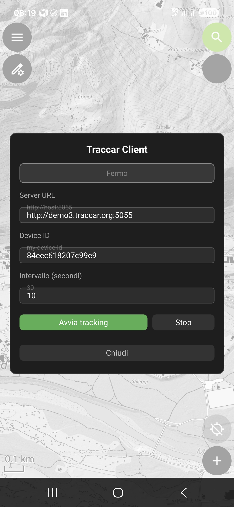
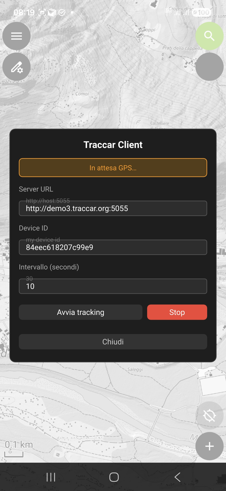
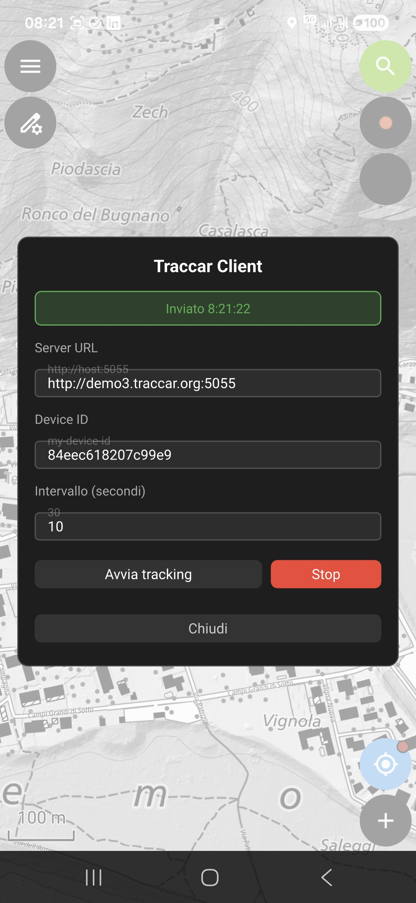
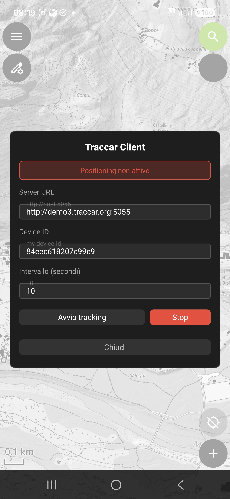

# QField Traccar Client

App-wide plugin for [QField](https://qfield.org/) that sends the device GPS position to a [Traccar](https://www.traccar.org/) server using the OsmAnd HTTP protocol.

## Features

- Periodic GPS position reporting (latitude, longitude, altitude, speed, bearing, accuracy)
- Configurable reporting interval
- Settings panel integrated directly in the QField UI
- Real-time event log (up to 20 entries, inspired by the *StatusActivity* of the Traccar Android client)
- Persistent settings across sessions (server URL, device ID, interval, tracking state)

## Screenshots

| Load | Seek | Connected | Some error |
|||||

## Protocol

```
GET http://<server>:<port>?id=<deviceId>&timestamp=<unix>&lat=<lat>&lon=<lon>&speed=<speed>&bearing=<bearing>&altitude=<alt>&accuracy=<acc>
```

Compatible with the Traccar OsmAnd port (default: `5055`).

## Installation

1. Download the ZIP file from the [Releases page](https://github.com/intelligeo/qfield-traccar-client/releases)
2. In QField open **Settings → Plugins**
3. Tap **Install plugin from URL** and paste the ZIP file URL,  
   or load the ZIP file directly from the device

## Configuration

After installation, tap the plugin's button in the QField toolbar to open the settings panel:

| Field | Description | Default |
|---|---|---|
| Server URL | Traccar server address | `e.g. http://demo.traccar.org:5055` |
| Device ID | Unique device identifier | `e.g. qfield-device-1` |
| Interval | Seconds between each position report | `10` |

## Requirements

- QField ≥ 3.x (with app-wide plugin support)
- Traccar server ≥ 5.x

## License

[GPL-2.0](LICENSE)

## Author

INTELLIGEO.ch — Dr. Sara Lanini-Maggi
